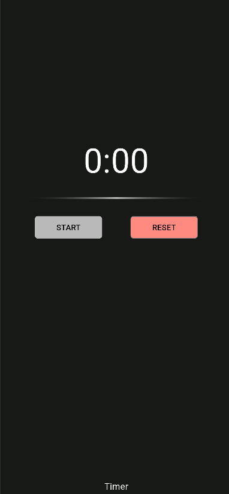

# 📌 Timerpoc

Aplicativo simples em **Flutter** que implementa um cronômetro (start, stop e reset) com arquitetura **MVVM**.

---

## 🚀 Tecnologias
- [Flutter](https://flutter.dev/) (SDK 3.x+)
- [Dart](https://dart.dev/)
- [Provider](https://pub.dev/packages/provider) (gerenciamento de estado)

---

## 📂 Estrutura de pastas
```
lib/
 ├── main.dart
 └── src/
     ├── core/                # Configurações globais
     │   ├── app.dart
     │   ├── router.dart
     │   └── theme.dart
     │
     ├── utils/               # Constantes, estilos e helpers
     │   ├── colors.dart
     │   ├── text_styles.dart
     │   ├── formatters.dart
     │   └── context_ext.dart
     │
     ├── widgets/             # Componentes reutilizáveis
     │   ├── app_button.dart
     │   ├── fade_divider.dart
     │   └── gap.dart
     │
     └── features/
         ├── splash/          # Tela de Splash
         │   ├── view/splash_view.dart
         │   └── viewmodel/splash_viewmodel.dart
         │
         └── timer/           # Cronômetro
             ├── model/timer_state.dart
             ├── services/ticker.dart
             ├── view/timer_view.dart
             └── viewmodel/timer_viewmodel.dart
```

---

## 📱 Funcionalidades
- **Splash Screen** com logotipo.
- **Cronômetro** com funções:
    - **START**: inicia a contagem.
    - **STOP**: pausa a contagem.
    - **RESET**: zera o contador.

---

## 🛠️ Como rodar
1. Clone este repositório:
   ```bash
   git clone https://github.com/seu-usuario/timerpoc.git
   cd timerpoc
   ```

2. Instale as dependências:
   ```bash
   flutter pub get
   ```

3. Execute o app:
   ```bash
   flutter run
   ```

---

## 🎨 Preview

SplashScreen: 


Timer:


---
